# AWS Secure Container Delivery Pipeline

This lab uses one imaginary vulnerable FastAPI e-commerce application to implement security pipeline.

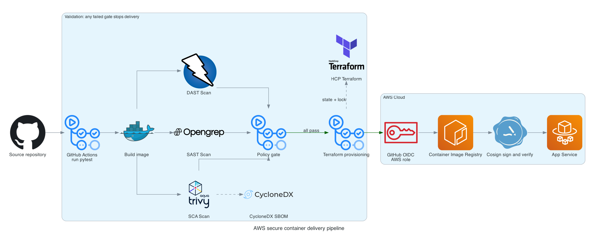

## Workflow

1. Install the test dependencies and run pytest.
2. Build the container.
3. Run Trivy against the final image for Critical OS and Python package findings.
4. Run the local Opengrep rule against the login implementation.
5. Start that same image on an internal Docker network and run an OWASP ZAP scan.
6. Generate a CycloneDX SBOM with Trivy.
7. Package the image only if every security gate passes.
8. For an approved main branch run, obtain short-lived AWS credentials through GitHub OIDC, push the same image to ECR, sign and verify its digest with Cosign, and update ECS.

## Experiments

### Experiment 1: Dependencies and Vulnerable Container

We are expecting to find the vulnerable packages / container images below using Trivy

| Layer | Installed package | Expected CVE |
| --- | --- | --- |
| Alpine | sqlite-libs 3.48.0-r0 | CVE-2025-3277 |
| Python | Authlib 1.6.8 | CVE-2026-27962 |
| Python | SQLAlchemy 1.2.17 | CVE-2019-7164 |
| Python | SQLAlchemy 1.2.17 | CVE-2019-7548 |

### Experiment 2: SAST for login SQL Injection

The `/login` route reaches `_load_login_record()` in `app/store.py`. That function inserts `credentials.username` into an SQL string before passing it to `connection.execute()`.

The workflow downloads Opengrep, and scans the file with `opengrep/experiment2-sql-injection.yml`.

### Experiment 3: DAST for Security Header Misconfiguration

The `/search` route HTML encodes the submitted product query but omits browser security headers. (A lot of times, developers do not know about this) We will run the pinned OWASP ZAP passive baseline scan against `/search?q=keyboard`.

## CI Security Pipeline

# First run before remediation

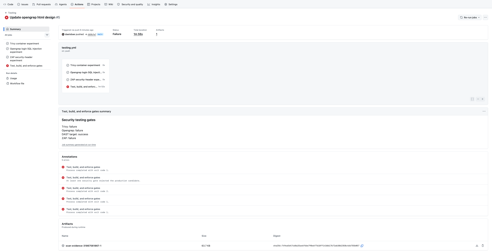

## SAST: login SQL injection

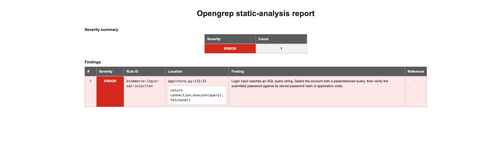

### Cause

`_load_login_record()` inserts username directly into SQL text and sends that string to db cursor. Because the value becomes part of the query syntax, a crafted username can alter the WHERE SQL syntax.

### Fix

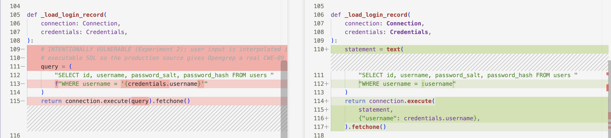

The remediation use the f-string query the `:username` placeholder. `connection.execute()` receives the unfiltered input (username) in a separate parameter, the SQLAlchemy function will filter it before execution.

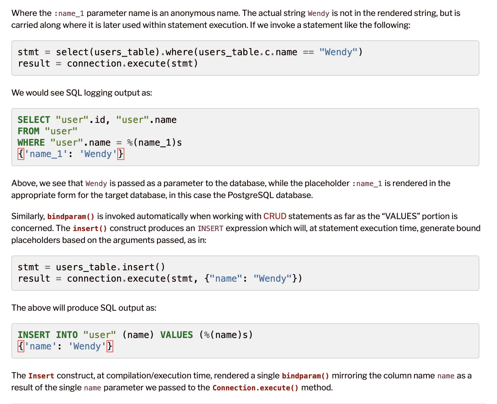

This is the [SQLAlchemy docs](https://docs.sqlalchemy.org/en/21/core/sqlelement.html) referenced above.

## DAST: missing browser security headers

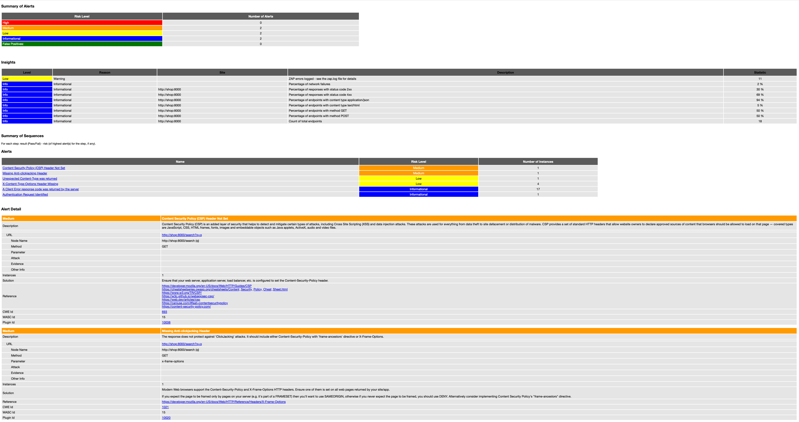

### Cause

The /search route escapes the query before writing it into HTML, but the application does not add browser security headers. ZAP found no Content Security Policy and no anti-clickjacking policy header. Informational and Low alerts remain visible without blocking delivery, while Medium and High alerts reject the production candidate.

### Fix

Add response middleware so every route receives Content-Security-Policy, `X-Frame-Options: DENY`, and `X-Content-Type-Options: nosniff`. A reasonable policy for this page is `default-src 'self'; object-src 'none'; base-uri 'none'; form-action 'self'; frame-ancestors 'none'` as it only allows application interaction itself without any legacy plugin.

## SCA: vulnerable container packages

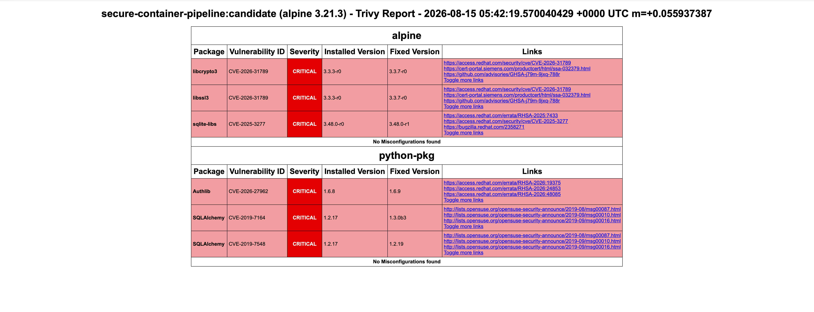

### Cause

The base image contains vulnerable version of libcrypto3, libssl3, sqlite-libs. The Python lock file also installs vulnerable version of Authlib and SQLAlchemy.

### Fix

Update to a container image that contains libcrypto3 and libssl3 3.3.7-r0 or newer, and sqlite-libs 3.48.0-r1 or newer. For python requirement.txt packages, update Authlib to 1.6.9 or newer, and replace SQLAlchemy 1.2.17.

# Run after remediation

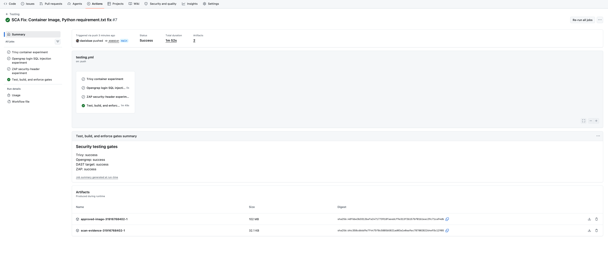

## SAST: login SQL injection

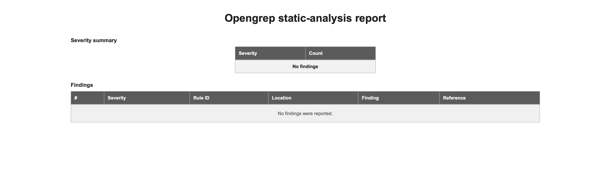

## DAST: missing browser security headers

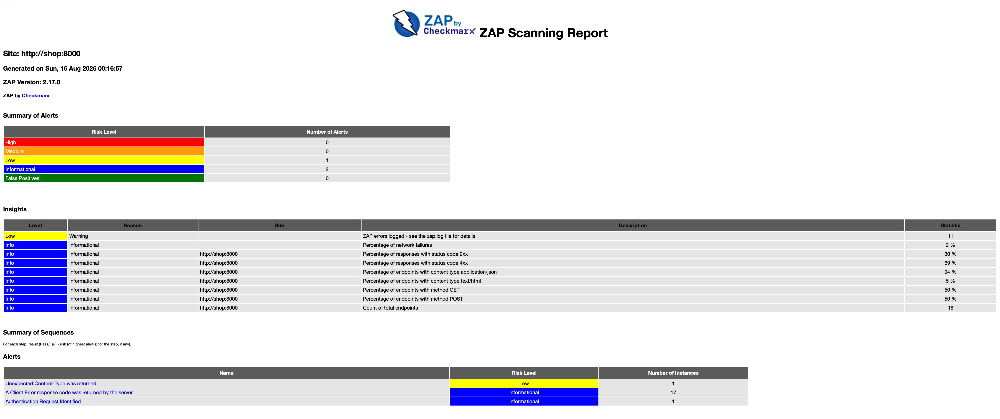

## SCA: vulnerable container packages

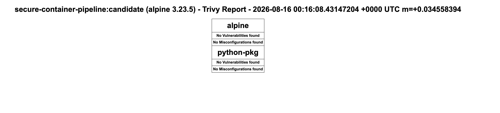

