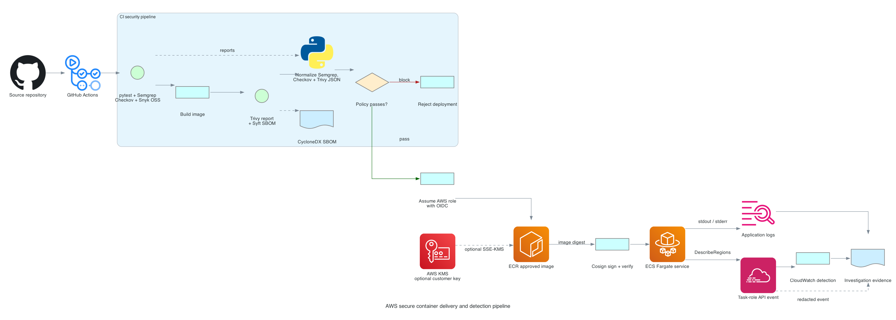

# AWS Secure Container Delivery and Detection Pipeline

This security pipeline lab is a small FastAPI service delivered to ECS Fargate through a security-focused GitHub Actions.

## Scenarios

### Experiment 1

Tests container rejection. A temporary branch pins `GitPython==3.1.29`, builds the final image, and demonstrates that the Trivy critical gate prevents that image from becoming an approved artifact. The run must leave the ECR digest and ECS task revision unchanged.

### Experiment 2

Tests the detection path. The service temporarily enables `POST /demo/cloudtrail`. The endpoint calls the read-only `ec2:DescribeRegions` API and returns only a scenario ID. The application log stores that scenario ID with the AWS SDK `RequestId` and ECS task identity. The task role has that one permission. A CloudWatch metric filter matches the task-role event and changes an alarm to `ALARM`. The investigation uses `aws cloudtrail lookup-events` and the shared request ID to verify the event. Detection latency is the first alarm timestamp minus the UTC trigger time; event-observation latency is recorded separately. CloudTrail delivery is delayed, so neither value is a real-time guarantee.

### Experiment 3

Tests the application-library gate. A separate trusted branch adds the vulnerable GitPython version and records the Snyk error annotation, JSON result, exit code, and policy status. Trivy may report the same dependency during that run. Experiment 3 succeeds when the Snyk evidence agrees with the blocked approved-image package.

The final results table records the blocked image, Snyk alert, deployed digest, finding counts before and after remediation, total pipeline duration, alarm detection latency, CloudTrail event-observation latency, and Terraform teardown result.

## Gate policy

- Any unit test failure stops the workflow.
- Runtime and test dependencies install from hash-checked locks; CI regenerates both locks and rejects drift.
- Snyk runs `test` against `requirements.txt` and the installed Python dependency tree. A critical finding produces a GitHub `Snyk application-library alert` error and blocks packaging.
- The workflow saves `snyk-open-source.json`, `snyk-open-source.log`, `snyk-exit-code.txt`, and `snyk-status.json`. `gate-summary.json` records the scan and policy outcomes.
- Every `pull_request` run skips the secret-backed Snyk step. Trusted `push` and `workflow_dispatch` runs fail closed when `SNYK_TOKEN` or `SNYK_ORG` is missing, the CLI cannot be installed, or the scan does not pass. The workflow does not use `pull_request_target` to bypass this boundary.
- This lab does not run `snyk monitor`. It creates no continuously monitored Snyk project snapshot, so dashboard and email alerts for newly disclosed issues are outside the experiment. This avoids adding persistent external snapshot retention to the lab.
- Semgrep runs with `--strict --error --severity ERROR`.
- The Semgrep `p/python` policy is fetched from the registry at run time. The Semgrep binary is pinned, but the remote rule content is current rather than byte-pinned; vendor a reviewed ruleset before using this as production policy.
- The free Checkov gate fails on every unsuppressed Terraform check. Severity-only gating depends on platform metadata, so this lab does not pretend that Checkov can always identify a "critical" result.
- Deliberate lab exceptions use inline `#checkov:skip=<ID>:<reason>` comments in the Terraform. The pipeline blocks every other failure.
- Snyk checks the declared Python application libraries before the image is approved. Trivy scans the final image, including OS packages and installed application packages. Both gates block critical findings, but their advisory data and severity ratings can differ.
- Trivy saves a full JSON report and separately fails on `CRITICAL` vulnerabilities with `--exit-code 1`. The vulnerable-dependency demo does not use `--ignore-unfixed`.
- Missing or malformed scanner output stops deployment.
- Raw reports are uploaded as run artifacts even when a gate blocks deployment.
- The vulnerable image never reaches ECR.
- Third-party GitHub Actions are pinned to full commit SHAs.
- Semgrep, Checkov, Trivy, Syft, Snyk, and Cosign use pinned versions recorded in the run summary.
- The deployment job has only `contents: read` and `id-token: write` unless another permission is justified.
- Cosign signs the pushed digest and verifies the exact GitHub workflow identity before ECS is updated.
- ECS receives `repository@sha256:...`, not `latest`.

ECS does not provide Cosign admission enforcement in this design. Signature verification is a pre-deployment CI gate, not a runtime admission control.

Terraform ignores the service's task-definition revision after CI takes over deployment. The workflow clones the active revision and changes only the image and `DEMO_MODE`. If the Terraform task-definition baseline is hardened later, recreate the disposable foundation or reconcile the active revision before another deployment. This lab expects the foundation to be finalized before the first image is released.

