## Infrastructure and deployment setup

The Delivery workflow starts after Testing github action workflow succeeds on a git push.

### Configure HCP Terraform state

Set the HCP Terraform workspace execution mode to Local (custom). Terraform commands then run on the GitHub-hosted runner, while HCP Terraform stores and synchronizes the state.

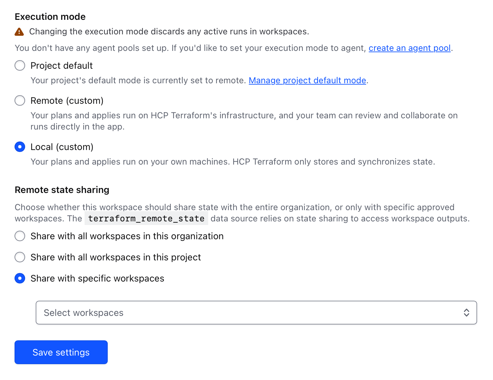

Create API token to bind it to github actions

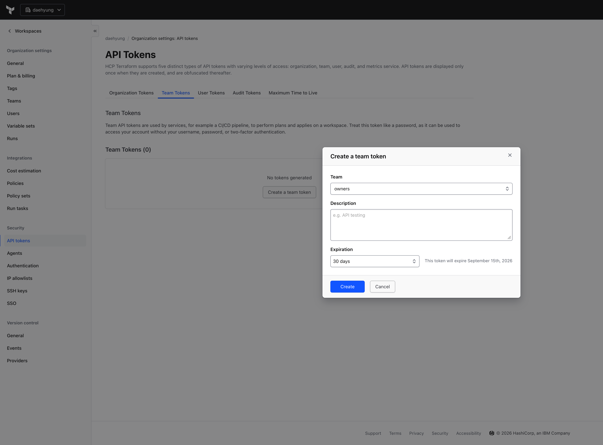

Put the token inside github secret

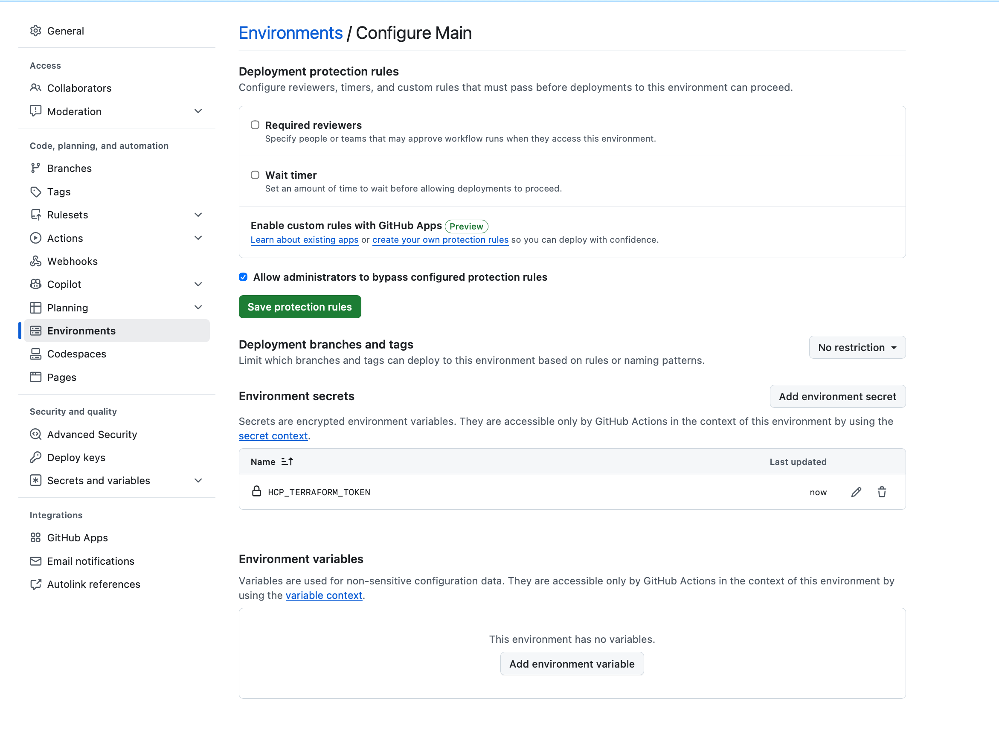


| Name | Type | Required value |
| --- | --- | --- |
| HCP_TERRAFORM_TOKEN | Secret | The HCP Terraform team token |
| HCP_TERRAFORM_ORGANIZATION | Variable | The exact HCP Terraform organization name |
| HCP_TERRAFORM_WORKSPACE | Variable | The exact HCP Terraform workspace name |
| AWS_TERRAFORM_ROLE_ARN | Variable | The ARN of the bootstrap IAM role, in the form `arn:aws:iam::<ACCOUNT_ID>:role/<ROLE_NAME>` |
| AWS_DELIVERY_OIDC_SUBJECT | Variable | The exact GitHub OIDC claim for the environment, without a wildcard |

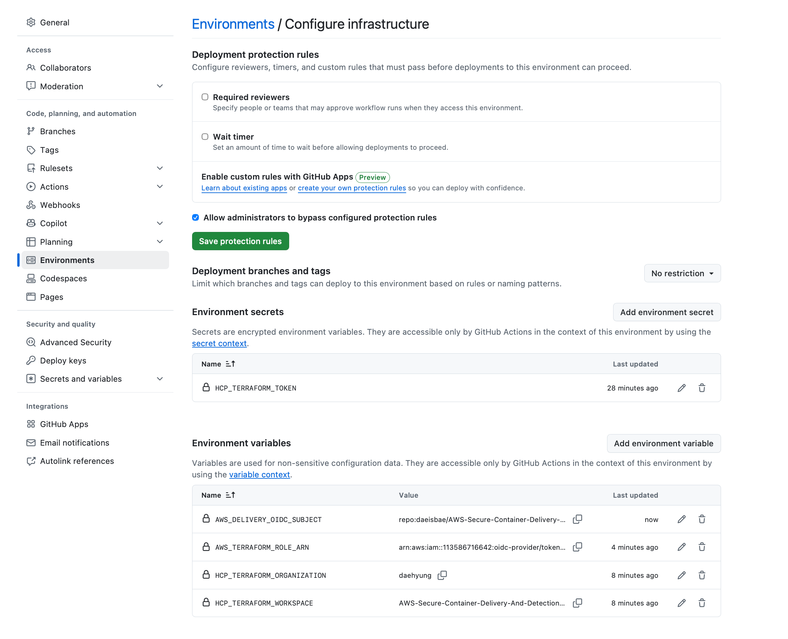

### Create the AWS OIDC provider for Github Deployment

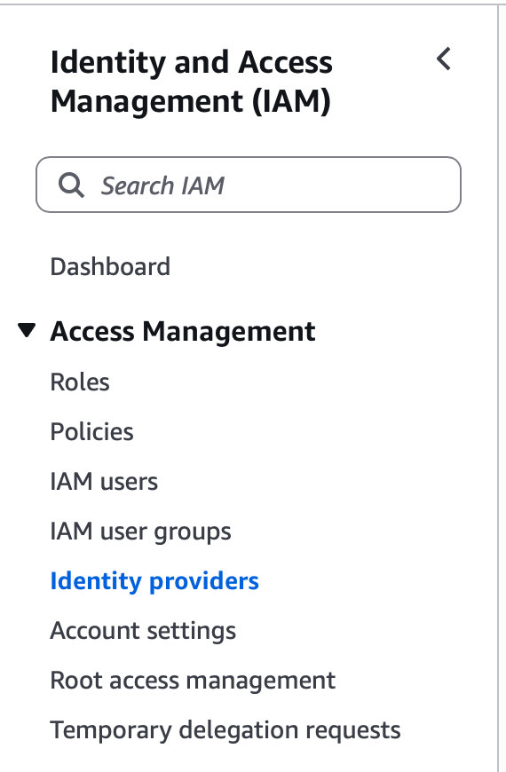

| Field | Value |
| --- | --- |
| Provider URL | `https://token.actions.githubusercontent.com` |
| Audience | `sts.amazonaws.com` |

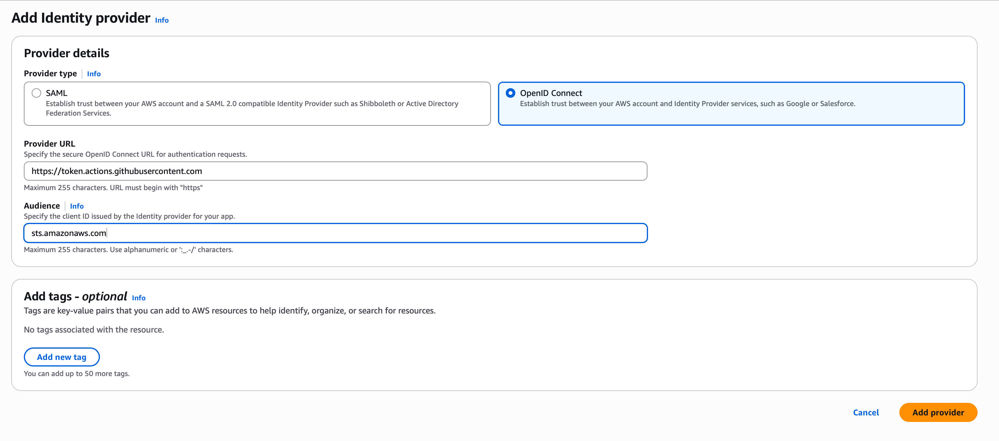

### Create the Terraform deployment role

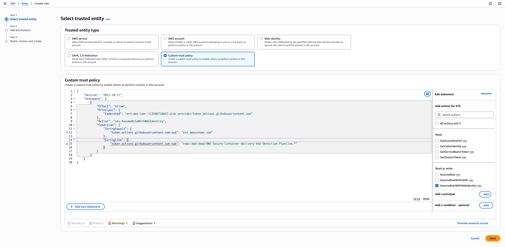

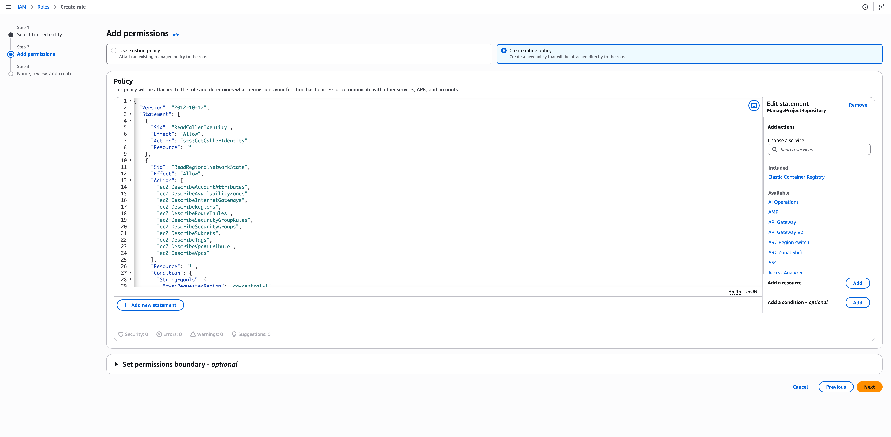

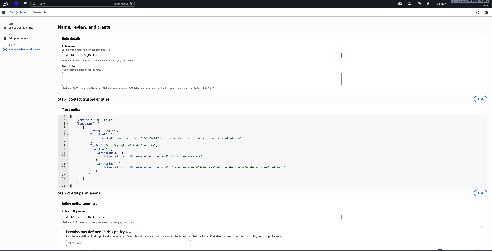

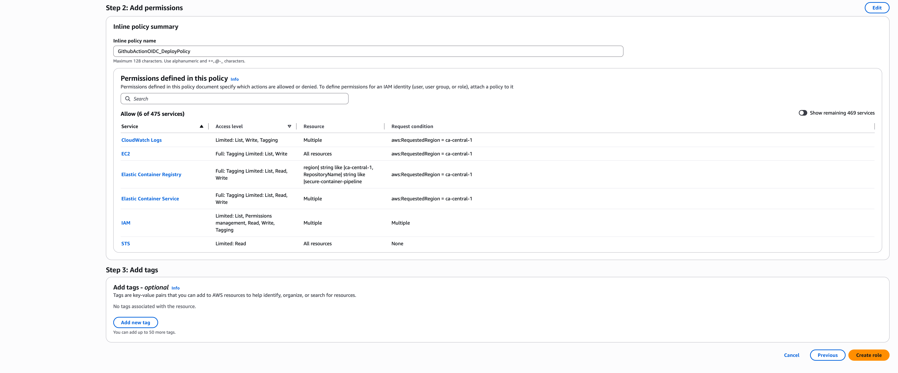

### Correct the role ARN before running the workflow

`AWS_TERRAFORM_ROLE_ARN` must contain the IAM role ARN. The captured value below ends with `oidc-provider/token.actions.githubusercontent.com`, so it is the provider ARN and cannot be passed to `role-to-assume`.

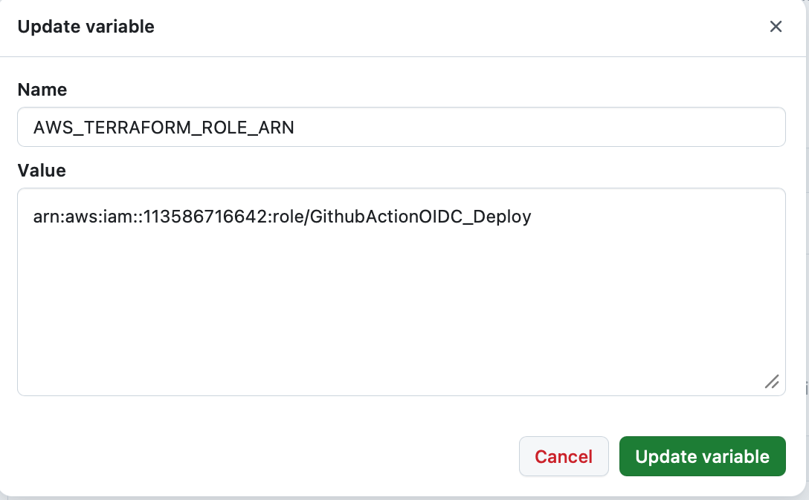

Use a value with this shape instead:

```text
arn:aws:iam::<ACCOUNT_ID>:role/GithubActionOIDC_Deploy
```